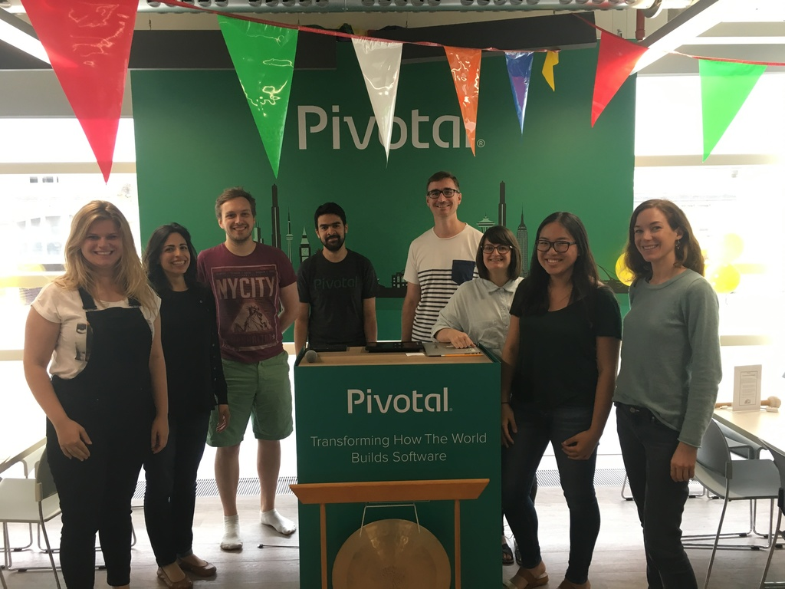

Hi, we’re [Emma](https://twitter.com/EmmaMDeacon) and [Kara](https://twitter.com/KaraMarck), the members of Pivotal, London! We’re working on [Babel](https://github.com/babel/babel) the JavaScript language compiler, with the help of our incredible mentor [Henry Zhu](https://twitter.com/left_pad), our supportive supervisor [Ines](https://twitter.com/ines_opcoelho), and our amazing hosts [Pivotal](https://twitter.com/pivotal). We’re so lucky to be in this position, and we cannot thank Rails Girls Summer of Code enough!!

######*Image Credit: Giphy*

***so fabulous***

######*Image Credit: Giphy*

We met through [Founders and Coders](https://twitter.com/founderscoders), and we were joined together by fate ❤️ Hahah no, not really, we were paired together during one of the paired programming sessions on Object Oriented Programming, and since then, we’ve always be involved in coding and being involved in the women in technology scene. We are deeply and passionately involved in [codebar](https://twitter.com/codebar?lang=en-gb) and a huge number of other coding meetups and coding classes in and around London - if you ever want to know about which ones to attend if you’re in London, we’ve got tonnes to recommend! :)

Emma is currently doing her MSc in Technology Entrepreneurship at UCL, and Kara was working as a developer at Ticketmaster before joining Rails Girls Summer of Code. Both of us have been involved in smaller team projects through Founders and Coders, but this is the first time we have been heavily involved in Open Source projects.

One of the best things about working somewhere like Pivotal is the incredibly open and friendly environment (as well as the amazingggg breakfasts 😍 😍), and despite having only been here two days, we have already learnt a tonne about Babel and compilers in general. We’re really lucky to have so many coaches, who are truly interested and passionate about promoting women in technology, and women in open source. We’ve had two informative and engaging lunch and learns with them (and we’ve haven't even been here two full days!), where we’ve explored working in a technology company, and the scope of future technology teams.  

And now... we’re pleased to introduce you to our coaches!!

######*Image Credit: Giphy*

***drum roll, please***

Firstly, we have [Denise Yu](https://twitter.com/deniseyu21), who has acted as our primary lead coach at Pivotal, and who we hope to be one day ❤️ As well as Denise, we are privilleged and incredibly humbled to have a huge and overwhelming number of additional coaches. This is just proof of how kind and thoughtful Pivotal is; we could not have asked for more opportunities, and we are both overwhelmed by the amount of support we are receiving. We have coaching support and guidance from [Jonathan Sharpe](https://twitter.com/jonrsharpe), [Josh Hill](https://twitter.com/jamesjoshuahill), [Derik Evangelista](@kirederik), [Winifred Bridgewater](@thepreviewmode), Maria Ntalla and Thomas Godkin! We are so lucky to have the support from these Pivots, and we cannot wait to work with them for the next three months.

######*Image Credit: Personal Photo*

**😍 Our incredible Pivotal team 😍**

We had an AMAZING first day, and met so many developers from different parts of Pivotal. We had an unbelievable afternoon, where we got to speak to Henry and Ines, and really understand more about the incredible Rails Girls community, and where the future of team Pivotal lay.

######*Image Credit: Giphy*

This is how we felt after our first day. INVINCIBLE. WE CAN DO THIS. THIS IS AMAZZZZIIINNNNGGGGGGGG!!!!!! WE'RE GOING TO LEARN SO MUCH 🦄 🦄 🎊 🎊 🎉 🎉

As well as being involved with an awesome team, we’ve embarked on an even more challenging and ambitious project thanks to Pivotal… PING PONG.

######*Image Credit: Giphy*

Because we rarely give up in the face of a challenge, we’re planning on making a projection graph over the summer to pinpoint our ping pong growth (which we all know is the more complicated element of learning to code). Some may say it's - in fact - the most crucial element to learn...

**Our goals are**
* Help and contribute to Babel, and be involved in as many aspects of the project as possible
* Become better JavaScript developers
* Apply for the 2020 Olympic Ping Pong team
